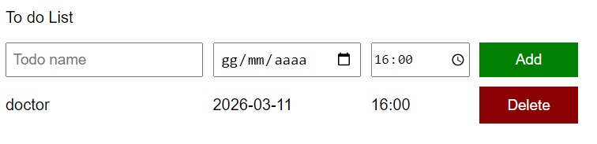

# To do list

An app where you can write a to-do list with the date.

## Screenshots

### Try [Here!](https://mrmax01.github.io/to-do-list/)
## Description
Once you write the to-do with the date, it gets listed below and saved in localStorage.
- Pressing the 'Enter' key or clicking 'add' adds the to-do to the list.
- by clicking on 'delete' it will be removed from the list and from the localStorage.  

*I used an object array with name, date, time attributes to save the list.* 

## 🛠 Skills
Javascript, HTML, CSS

## Authors

- [@Massimo](https://www.github.com/MrMax01)

